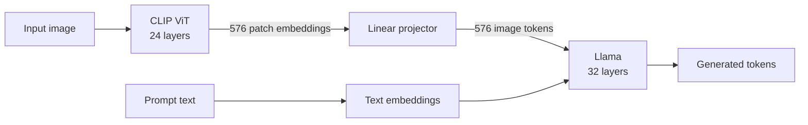
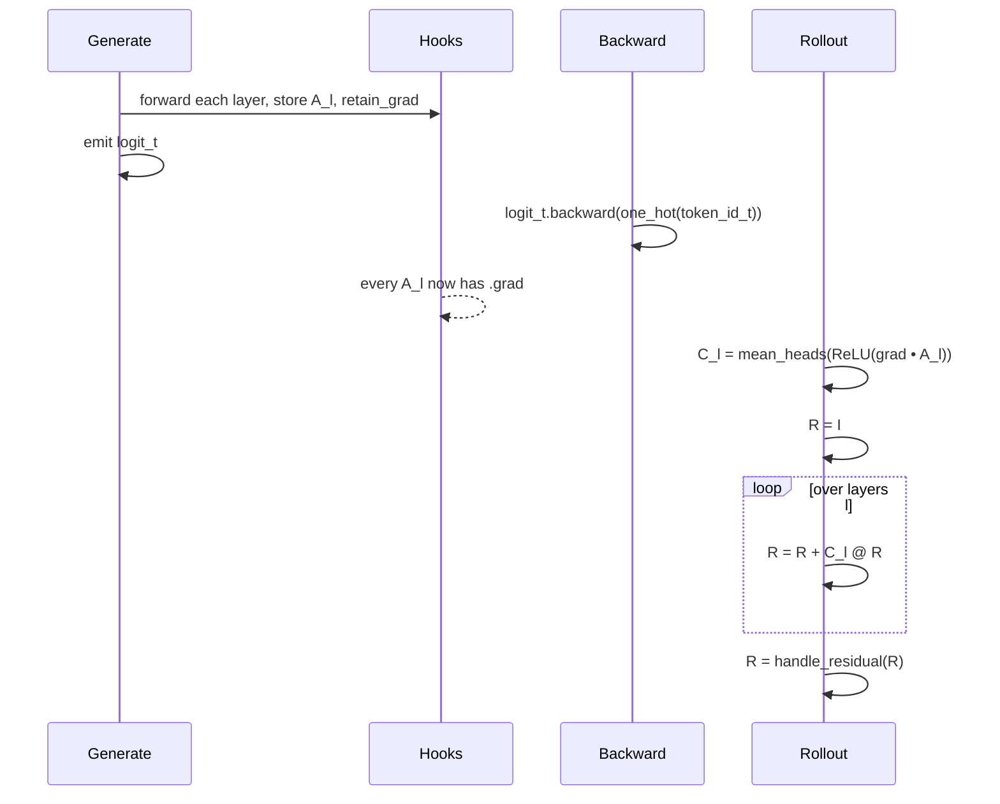
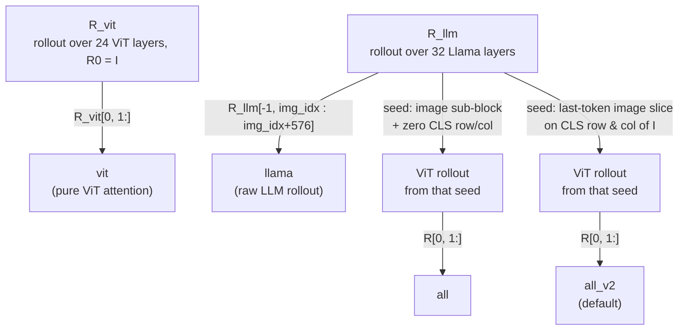

# LVLM Relevancy Maps

Minimal pipeline for generating per-token relevancy-map heatmap overlays for
Large Vision-Language Models (LLaVA / LLaVA-Gemma), based on
[LVLM-Interpret](https://arxiv.org/abs/2404.03118).

Requires `transformers >= 5.0`.

## Setup

### Local

```bash
uv sync
```

### Google Colab

```python
!pip install uv
!uv sync
```

Torch + torchvision come pre-installed on Colab. Select a GPU runtime
(`Runtime → Change runtime type → T4 / A100 GPU`).

## Usage

```bash
uv run tests/test_interpret.py \
    --model_name_or_path llava-hf/llava-1.5-7b-hf \
    --image path/to/image.jpg \
    --prompt "What is in this image?" \
    --output_dir ./output_relevancy \
    --load_8bit
```

### Options

- `--rel_type` — relevancy variant. One of `llama` (raw LLM-space rollout,
  noisiest), `llama_token`, `vit` (ViT-space), `all`, `all_v2` (default,
  usually the cleanest).
- `--load_8bit` / `--load_4bit` — bitsandbytes quantization.
- `--max_new_tokens`, `--temperature` — generation controls.
- `--device_map` — default `auto`.
- Overlay tuning: `--p_low`, `--p_high`, `--blur_radius`, `--max_alpha`,
  `--alpha_gamma`. Raise `--p_low` (e.g. 75-80) for tighter hotspots.

One PNG overlay is saved per generated non-separator token, plus
`preprocessed_image.png`.

## Files

- `tests/test_interpret.py` — CLI entrypoint.
- `src/model.py` — model loading, `_sample` grad-patch, attention hooks.
- `src/relevancy.py` — relevancy-map construction (rollout + gradient rule).
- `src/visualization.py` — `draw_heatmap_on_image` overlay helper.

---


# How the Relevancy Maps Work

This pipeline answers the question: *"when the model generated the word **giraffe**, which image patches did it actually use?"* — exactly the kind of question Grad-CAM answers for CNNs, but adapted for transformers.

## TL;DR vs Grad-CAM

| | Grad-CAM | This pipeline |
|---|---|---|
| Model | CNN | LLaVA (CLIP ViT → projector → Llama) |
| "Activation" | channel maps $A^k \in \mathbb{R}^{H\times W}$ of a conv layer | attention maps $A^{(l)} \in \mathbb{R}^{H \times N \times N}$ of **every** self-attention layer |
| Target | class logit $y^c$ | logit of a **generated token** |
| Weighting | spatial mean of gradient per channel | elementwise $\nabla A \odot A$, ReLU, averaged across heads |
| Aggregation | weighted sum over channels of **one** layer | **rollout** across **all** layers |
| Output | single 2D map over spatial grid | 2D map over spatial patch grid, **per generated token** |

Same core idea — *gradient × activation, rectify, aggregate* — but transformers have no spatial convolutions, so you aggregate across layers instead of across channels, and the activation is a 2D attention matrix rather than a 2D spatial feature map.

## Method

Follows Chefer et al., *Generic Attention-model Explainability* (ICCV 2021), extended to LVLMs by *LVLM-Interpret* (Stan et al., 2024).

### Per-layer CAM (rule 5)

For each self-attention layer $l$ with attention tensor $A^{(l)} \in \mathbb{R}^{H \times N \times N}$ (H heads, N tokens):

$$
C^{(l)} = \underset{h}{\mathrm{mean}}\, \mathrm{ReLU}\!\left( \nabla A^{(l)} \odot A^{(l)} \right) \in \mathbb{R}^{N \times N}
$$

That's `avg_heads(cam, grad)` in the code:

- **Elementwise grad × attention** — attention weights aligned with the gradient (i.e. the ones that matter for the target logit) get amplified.
- **ReLU** — keep only positive contributions.
- **Mean over heads** — collapse to a single 2D matrix.

### Rollout (rule 6)

Compose all $L$ layers into one effective token→token influence matrix:

$$
R^{(0)} = I, \qquad R^{(l)} = R^{(l-1)} + C^{(l)} \cdot R^{(l-1)}
$$

That's `handle_self_attention_image` in the code. The `+I` stand-in bakes in the residual stream; the matmul composes one layer's CAM with everything that came before.

Finally `handle_residual` removes the diagonal (the trivial self-loop), row-normalizes, and adds the identity back — this cleans up the bias where every row sums to something much larger than 1 after $L$ matmuls.

## The LLaVA-specific setup



Llama sees a flat token sequence:

```
[ prompt tokens ... | <image> × 576 | remaining prompt | generated so far ]
                      ^img_idx        ^img_idx + 576
```

Two sets of attention maps are captured by forward hooks registered in `src/model.py`:

- `model.enc_attn_weights`      — 32 Llama layers × `T` generated tokens
- `model.enc_attn_weights_vit`  — 24 CLIP ViT layers (captured once per image)

Every captured tensor gets `requires_grad_(True)` and `retain_grad()` so we can read `.grad` after backward.

### The `_sample` monkey-patch

`GenerationMixin.generate()` is wrapped in `@torch.no_grad()`, which would throw away everything we need. We replace `LlavaForConditionalGeneration._sample` with a version wrapped in `torch.enable_grad()` — that's the 4-line patch at the top of `src/model.py`. Gradients flow normally inside the sampling loop.

## One generated token → one relevancy map



Walk-through for generated token $t$ (roughly lines 180-200 of `src/relevancy.py`):

1. Build the one-hot gradient for the realized token id.
2. `token_logits.backward(...)` → gradients now live on every captured `A^{(l)}`.
3. Rule 5 + rule 6 across all 32 Llama layers → `R` is `(seq_len × seq_len)`.
4. The **last row** of `R` is the influence of each input position on the token we just generated.
5. Take the 576 positions corresponding to image patches and reshape to a 24×24 grid:

```python
heat = R[-1, img_idx : img_idx + 576].reshape(24, 24)
```

That's the raw patch-grid heatmap. It then goes to `draw_heatmap_on_image` for upsampling + colormap + alpha compositing.

## Four variants — how LLM and ViT get combined

There are 32 Llama layers *and* 24 CLIP ViT layers, so there's more than one way to compose them. The code produces four variants in parallel:



| Variant | What it captures | Typical look |
|---|---|---|
| `llama` | Pure LLM rollout. Every path from image patch → generated token through all 32 Llama layers. | Noisy, spread out ("confetti"). Includes projector + text decoder noise. |
| `vit`   | Pure CLIP ViT rollout. Prompt-independent — same map for every generated token. | Object-shaped but can be generic ("what the ViT finds salient"). |
| `all`   | Takes the image×image sub-block of the LLM rollout, wraps it with a CLS row/col, then propagates through the ViT. | Prompt-aware, but the seed is the full image-to-image matrix, so it can be diffuse. |
| `all_v2` (default) | Seeds only the **last token's image-attention slice** onto the CLS row/col of an identity, then runs the ViT rollout. | Usually the **sharpest, most object-shaped** map — prompt-aware yet focused. |

## Per-token vs per-word

The sampler emits subword tokens. `compute_word_rel_map` stitches them: if a token doesn't start with `▁` (SentencePiece word-start marker) and isn't a separator, its map is accumulated into the current word's map; otherwise the current word is finalized (averaged) and a new one begins.

`construct_relevancy_map` returns a dict with both granularities:

- `llama_token` — one map per subword token (`{token: R}`).
- `llama`, `vit`, `all`, `all_v2` — averaged per word (`{word: mean_R}`).

The CLI saves one PNG per non-separator word for whichever `--rel_type` you pick.

## From raw 24×24 → pretty overlay

`draw_heatmap_on_image` in `src/visualization.py` does three cleanup steps that take the result from "confetti" to "focused":

1. **Percentile normalization** (`p_low=60, p_high=99`) — kills the noise floor. Min-max stretches even tiny values, so a straightforward rescale makes noise look like signal.
2. **Value-dependent alpha** (`alpha = heat^gamma`) — low-heat pixels stay transparent so the underlying image is still readable. A flat 50% alpha floods the whole image in jet's low-end blue.
3. **Gaussian blur + single-channel upsample** — smooths the 24×24 patch grid before the colormap, hiding aliasing artifacts.

Bumping `--p_low` higher (75-80) or `--alpha_gamma` higher (1.5-2.0) shrinks the hotspot; lowering them spreads it out.

## How to read a map

After normalization, the value at patch $(i, j)$ is a scalar in $[0, 1]$. Loose interpretation:

> **"If the model couldn't see this patch, how much would the probability of this word drop?"**

Not literally that (it's a gradient-based first-order approximation, not a proper ablation), but that's the intuition.

Signals of a healthy map:

- **Content words** (`giraffe`, `grass`, `field`) → crisp hotspots on the corresponding object/region.
- **Function/filler words** (`the`, `is`, `a`) → diffuse, low-magnitude maps.
- **Factual claims** (`yes, this is a giraffe`) — "yes" should light up roughly the same region as "giraffe".

The sharp contrast between a content-word map and a function-word map is often more diagnostic than any single map on its own.

## Code map

| File | Responsibility |
|---|---|
| `src/model.py` | Load model, patch `_sample` for grad, register attention hooks. |
| `src/relevancy.py` | Rule 5 (`avg_heads`), rule 6 (`handle_self_attention_image`), rollout orchestration (`construct_relevancy_map`), word-level aggregation. |
| `src/visualization.py` | `draw_heatmap_on_image` — percentile norm + blur + value-based alpha + composite. |
| `tests/test_interpret.py` | CLI glue: load model, run `.generate`, call `construct_relevancy_map`, save overlays. |

## References

- Chefer, Gur, Wolf. *Generic Attention-model Explainability for Interpreting Bi-Modal and Encoder–Decoder Transformers.* ICCV 2021.
- Chefer, Gur, Wolf. *Transformer Interpretability Beyond Attention Visualization.* CVPR 2021.
- Stan et al. *LVLM-Interpret: An Interpretability Tool for Large Vision-Language Models.* 2024. ([arXiv 2404.03118](https://arxiv.org/abs/2404.03118))
- Selvaraju et al. *Grad-CAM.* ICCV 2017. (the CNN analog)
